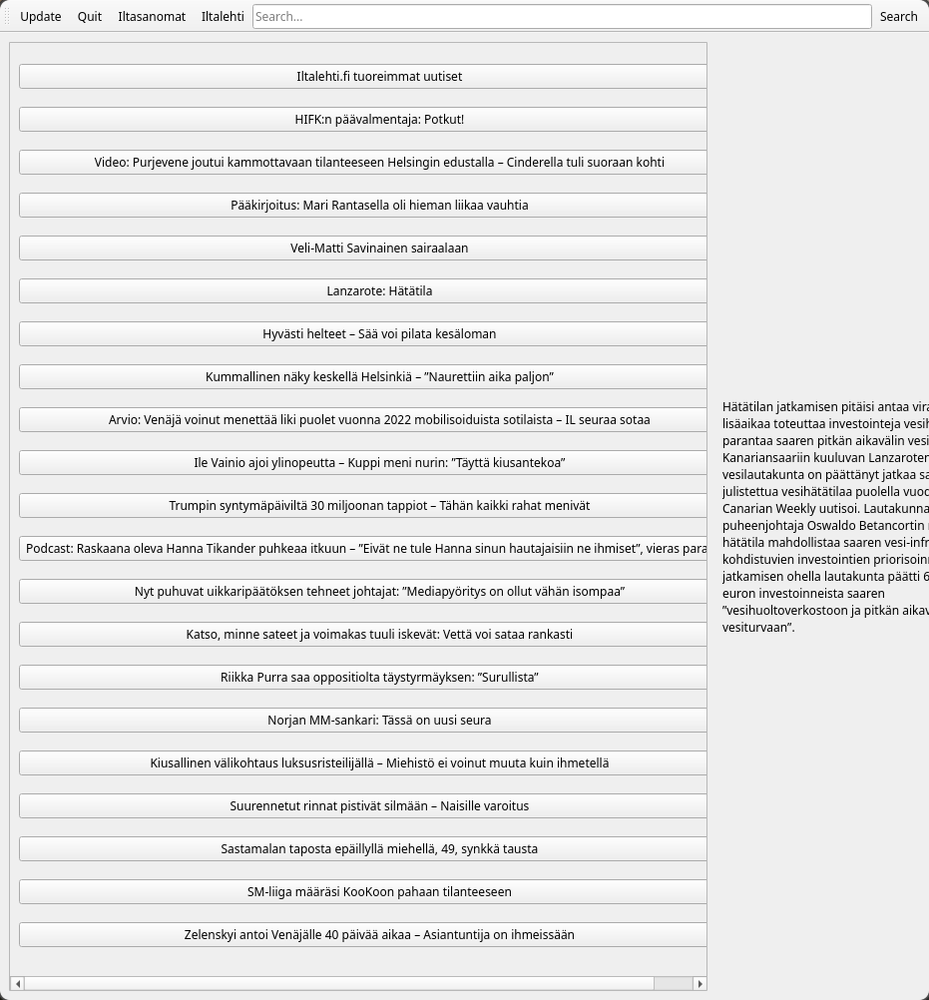

# Newscraper

Qt desktop app for reading news headlines from RSS feeds.



## Requirements

- Qt 6.8.1
- CMake 3.25+
- A C++23 compiler

## Build

```bash
mkdir build && cd build
cmake ..
cmake --build .
./newscraper
```

## License

MIT. See [LICENSE](LICENSE).

